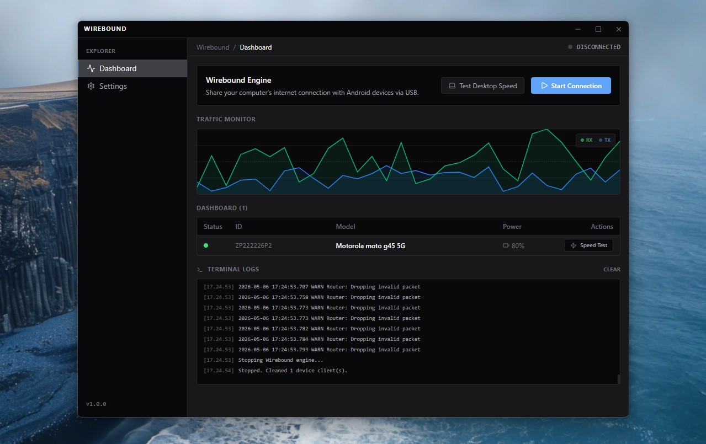
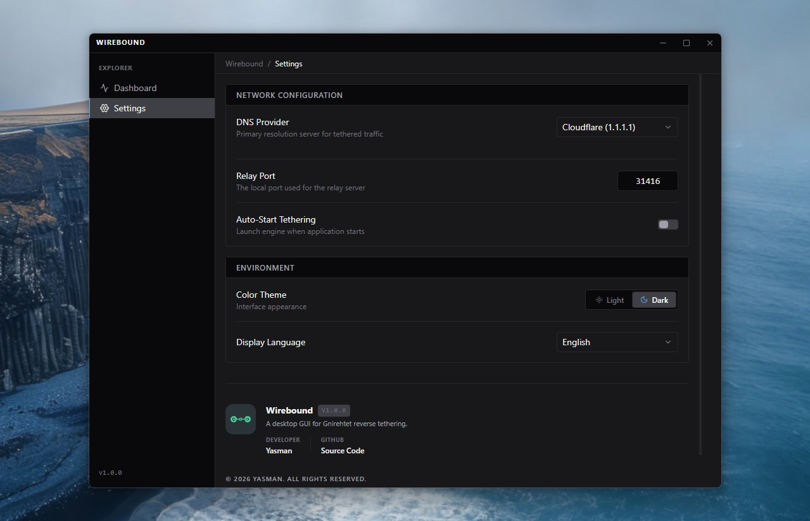

# Wirebound


Wirebound is a Windows desktop GUI for [Gnirehtet](https://github.com/Genymobile/gnirehtet), providing a management interface for reverse tethering. It allows Android devices to use a computer's internet connection via USB without requiring root access.

---

## 📸 Preview

<p align="center">
  
  
</p>

---

## ✨ Features

- **Auto-Run Engine**: Detects connected ADB devices and initiates reverse tethering automatically.
- **Traffic Monitor**: Visualizes data throughput with real-time charts.
- **Themed Interface**: Supports native Light and Dark modes.
- **DNS Configuration**: Includes presets (Google, Cloudflare) and custom DNS options.
- **Live Logs**: Real-time terminal output parser for debugging and status tracking.
- **Localization**: Available in English and Indonesian.
- **Bundled Binaries**: Includes Gnirehtet Rust and ADB binaries for immediate use in packaged builds.

---

## 💻 Relationship with Gnirehtet

**Wirebound** is an independent Windows desktop GUI and automation layer built around [Gnirehtet](https://github.com/Genymobile/gnirehtet). 

It uses Gnirehtet as the underlying reverse tethering engine and provides a graphical interface for device detection, connection management, DNS/Port configuration, and traffic monitoring. 

**Wirebound is not an official Gnirehtet project and is not affiliated with Genymobile.**

> **Note**: Gnirehtet runtime binaries (`.exe` and `.apk`) are bundled in the official release builds for convenience. If building from source, ensure the runtime files are placed in the `bin/` directory.

---

## 💻 Technical Overview

The application establishes a per-device VPN tunnel on the Android side that routes network traffic through a TCP relay server running on the PC. It automates the lifecycle of this relay and the ADB connection.

### 1. Execution Mode
Wirebound uses the `autorun` mode to monitor the ADB bus for new connections and deploy the required services to multiple devices simultaneously.

### 2. Architecture
Built with **Electron + Vite**, utilizing a decoupled structure:
- **Main Process**: Manages binary lifecycle and process pipes.
- **Renderer Process**: Isolated React UI layer with Tailwind CSS.
- **Preload Layer**: Secure Context Bridge for IPC.

### 3. Project Structure
```text
bin/          # Bundled binaries (Gnirehtet & ADB)
build/        # Installer assets & icons
resources/    # Dashboard screenshots
src/          # Application source code
package.json  # Project manifest
LICENSE       # Apache 2.0
```

### 4. Runtime Binaries
Wirebound release builds include the required Gnirehtet and ADB runtime files. 

If you build from source, you must prepare the following files manually in the `bin/` directory:
- `bin/gnirehtet-rust-win64/gnirehtet.exe`
- `bin/gnirehtet-rust-win64/gnirehtet.apk`
- `bin/gnirehtet-rust-win64/gnirehtet-run.cmd`
- `bin/platform-tools/adb.exe`

You can obtain the original Gnirehtet binaries from the [official Genymobile release page](https://github.com/Genymobile/gnirehtet/releases).

---

## 📖 Usage

### Step 1: Device Preparation
1. Enable **Developer Options** on the Android device.
2. Enable **USB Debugging**.

### Step 2: Connection
1. Connect the device via USB.
2. Authorize the ADB debugging prompt on the phone screen.

### Step 3: Execution
1. Run `Wirebound.exe`.
2. Configure DNS and Port in **Settings** if necessary.
3. Click **Start** in the Dashboard.
4. Accept the VPN request on the Android device.

---

## 🛠️ Development

```bash
# Clone the repository
git clone https://github.com/man612/wirebound.git

# Install dependencies
npm install

# Run in development mode
npm run dev

# Build for Windows
npm run build:win
```

---

## 📄 License & Credits

- **Wirebound GUI & Integration**: Built by [man612](https://github.com/man612).
- **Engine**: Powered by [Gnirehtet](https://github.com/Genymobile/gnirehtet) by Genymobile.
- **License**: Both projects are licensed under the **Apache License 2.0**.
- **Third-Party**: Detailed notices are available in [THIRD_PARTY_NOTICES.md](./THIRD_PARTY_NOTICES.md).
