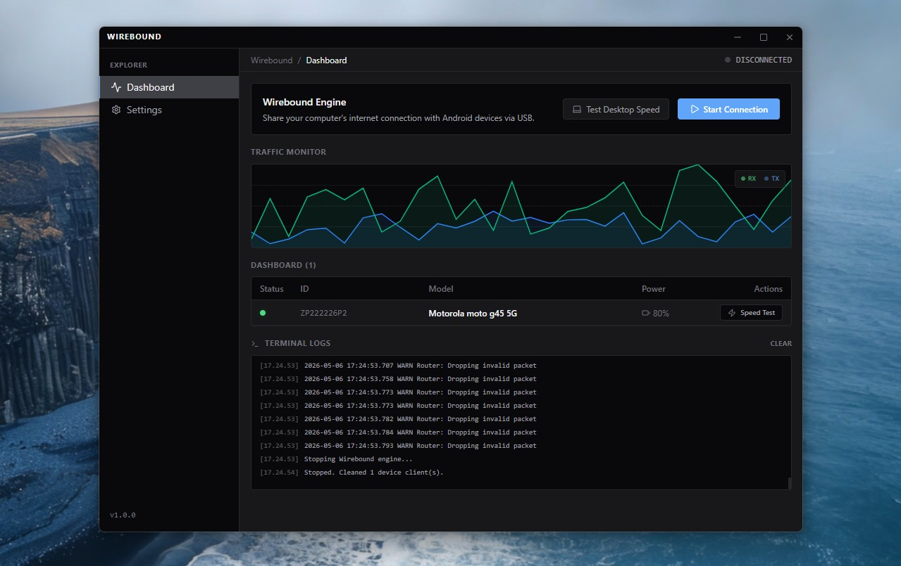
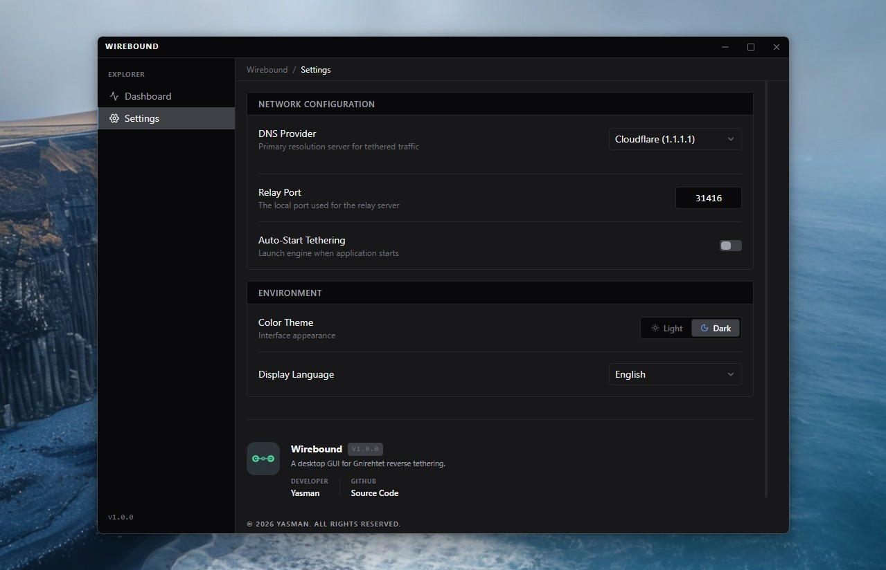

# Wirebound


Wirebound is a Windows desktop GUI for [Gnirehtet](https://github.com/Genymobile/gnirehtet). It lets an Android device use a Windows PC's internet connection over USB without root access.

Wirebound handles device detection, Gnirehtet process lifecycle, DNS and relay configuration, connection state, logs, and common ADB failure states so users do not need to memorize terminal commands.

## Project status

Wirebound is currently in **beta**. The core Windows reverse-tethering workflow works, but real-world compatibility still depends on Windows USB drivers, Android versions, device firmware, ADB authorization, and Gnirehtet itself.

A `Connected` state means the desktop relay is running and a Gnirehtet client is active on at least one Android device. It does **not** claim that end-to-end internet access has been independently measured. Use the built-in device speed-test action to verify actual connectivity.

## Preview

<p align="center">
  
  
</p>

## Features

- **Guided reverse tethering** — Start and stop the Gnirehtet relay from a desktop UI.
- **ADB-aware device status** — Distinguishes ready, unauthorized, offline, no-access, and ADB-unavailable states.
- **Connection state verification** — `Connected` requires both the PC relay process and an active Gnirehtet Android client.
- **DNS and relay settings** — Google, Cloudflare, custom IPv4 DNS, and configurable relay port.
- **Live engine logs** — Gnirehtet output stays visible for troubleshooting.
- **Device speed-test shortcut** — Opens Fast.com on an authorized Android device to verify real connectivity.
- **Light and dark themes** — With English and Indonesian localization.
- **Graceful cleanup** — Stopping or closing Wirebound also attempts to stop Gnirehtet clients on attached devices.

Wirebound intentionally does **not** show fabricated traffic telemetry. A real throughput monitor can be added later only when it is backed by measurable network counters.

## Relationship with Gnirehtet

Wirebound is an independent GUI and automation layer around Gnirehtet. It is not an official Genymobile project and is not affiliated with Genymobile.

Gnirehtet creates a VPN interface on Android and forwards traffic to a TCP relay on the PC. Wirebound manages that lifecycle and the ADB interactions around it.

Gnirehtet upstream is lightly maintained, so Wirebound pins a known runtime version instead of silently following an unversioned latest binary.

## Runtime dependencies

Release builds currently pin:

- **Gnirehtet:** 2.5.1, Rust Windows build
- **Android SDK Platform Tools:** 37.0.1

Runtime archives are downloaded by `scripts/prepare-runtime.ps1` and verified with SHA-256 before extraction. Generated runtime files are ignored by Git, so the repository does not rely on manually copied binaries.

Wirebound uses a dedicated local ADB server on port **5038**. The normal ADB server on port 5037 is left alone, so closing Wirebound does not intentionally stop an ADB server used by Android Studio or other tools.

## Usage

1. Enable **Developer options** and **USB debugging** on the Android device.
2. Connect the device to the PC with USB.
3. Accept the Android USB-debugging authorization prompt.
4. Open Wirebound.
5. Configure DNS or relay port only if needed.
6. Click **Start Connection**.
7. Accept the Gnirehtet VPN permission prompt on Android.
8. When Wirebound reports `Connected`, use **Speed Test** if you want to verify end-to-end internet access.

If Wirebound reports `Unauthorized`, `Offline`, `No access`, or `ADB unavailable`, resolve that state before troubleshooting the relay itself.

## Development

Requirements: Windows, Node.js 24+, npm, PowerShell, and Git.

```powershell
git clone https://github.com/man612/wirebound.git
cd wirebound
npm ci
npm run runtime:prepare
npm run dev
```

Useful verification commands:

```powershell
npm run lint -- --no-cache
npm run typecheck
npm test
npm run build
npm run package:check
```

`package:check` builds an unpacked Windows application and verifies that the packaged app can include the pinned runtime. `npm run build:win` produces the Windows installer.

## Architecture

- `src/main` — Electron main process, window hardening, IPC validation, ADB and Gnirehtet services.
- `src/preload` — Narrow context bridge exposed to the renderer.
- `src/renderer` — React/Tailwind interface.
- `src/shared` — Shared types, defaults, and settings normalization.
- `scripts` — Reproducible runtime preparation.
- `bin` — Generated runtime directory; only its documentation is tracked.

Wirebound is intentionally Windows-only today. The runtime paths, ADB distribution, packaging, and CI are designed and verified for Windows rather than advertising unsupported macOS/Linux builds.

## Releases

CI runs on Windows and verifies linting, TypeScript, unit tests, production build, and an unpacked package smoke test. Tags matching `v*` trigger the Windows release workflow.

Release artifacts should be treated as the canonical user distribution. Source checkouts fetch pinned runtime dependencies during development/build rather than storing executable binaries in Git.

## License and credits

Wirebound is licensed under the **Apache License 2.0**.

- Wirebound GUI and integration: [man612](https://github.com/man612)
- Reverse-tethering engine: [Gnirehtet](https://github.com/Genymobile/gnirehtet) by Genymobile
- Android device tooling: Android SDK Platform Tools / ADB by Google
- Third-party details: [THIRD_PARTY_NOTICES.md](./THIRD_PARTY_NOTICES.md)
